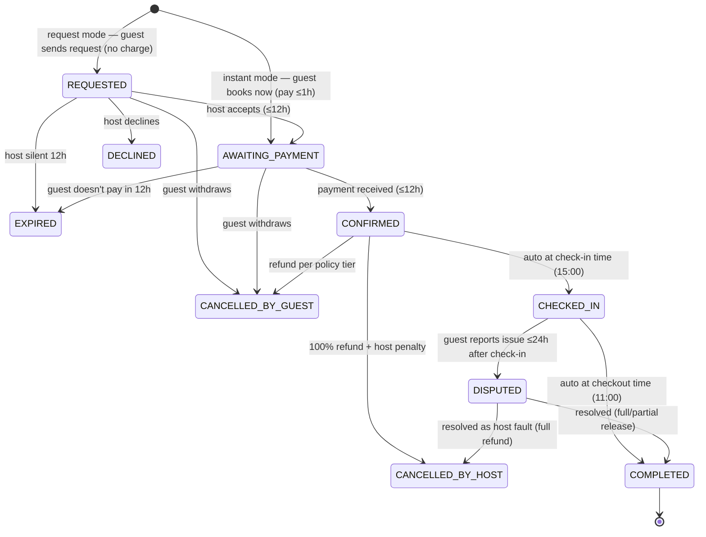
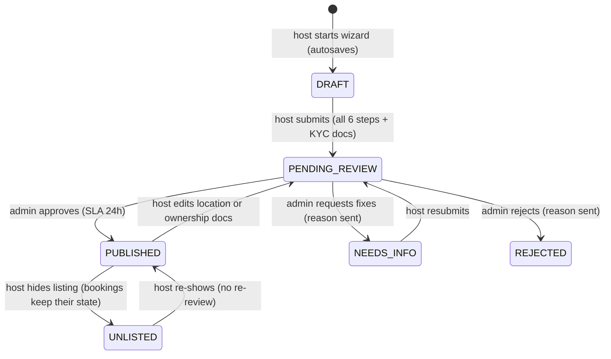
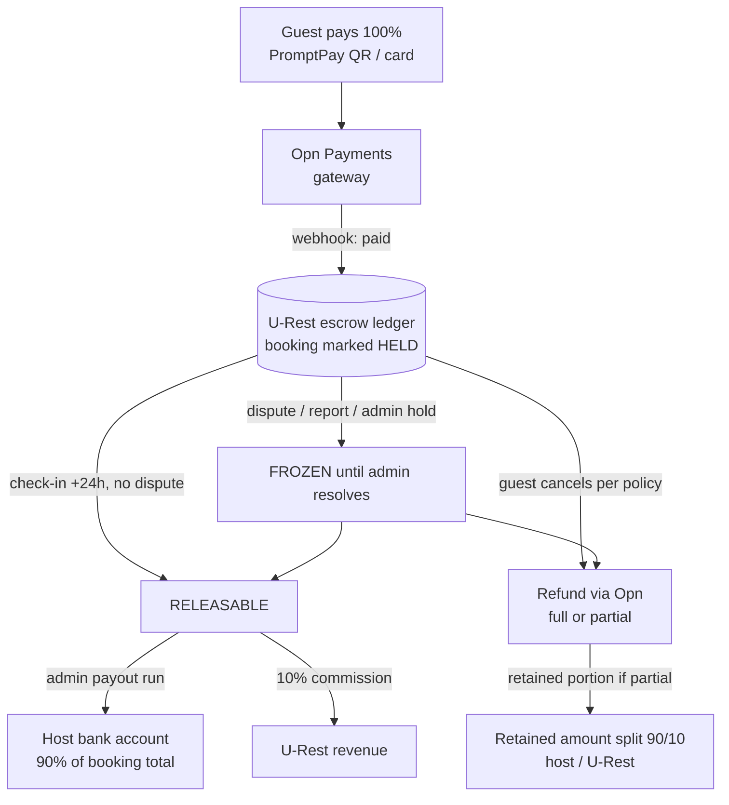

# U-Rest — Product Flows (v1)

Functional contract for all roles and features. Companion to `DESIGN_SPEC.md` (look & layout — this document covers behavior and *why*). State names here are canonical: code, DB enums, and UI pills must match them exactly.

Roles covered: **Guest** (ผู้เข้าพัก) · **Host** (โฮสต์) · **Admin** (ทีมงาน)

---

## 1. Roles & accounts

One `User` account can hold multiple roles:

| Role | How obtained | What it unlocks |
|---|---|---|
| **Guest** | Default on signup (LINE Login or email+password) | Search, AI concierge, booking, trips, messages, reviews |
| **Host** | Guest taps "เป็นโฮสต์กับเรา" → completes first listing wizard + KYC | Host dashboard (`/host`), listings, requests inbox, calendar, payouts |
| **Admin** | Staff-only; created manually in DB, separate login surface (`/admin`), no self-signup ever | Approval queue, payouts, disputes, user management, audit log |

**Why one account for guest+host:** Thai villa owners also travel; forcing two accounts splits their identity, reviews, and LINE notifications. The UI switches context (sand chrome = guest, ink chrome = host), not the account.

**Verification ladder** (each step unlocks more):
- Signup → can browse, save villas, chat with AI.
- **Phone OTP verified** → can send booking requests and messages (anti-spam floor).
- **KYC verified (host only)** → Thai national ID + right-to-rent doc + selfie, reviewed by admin per listing. No listing goes live without it — this is the product's core trust promise.
- **ถูกต้องตามกฎหมาย badge (host, optional)** → host additionally uploads a hotel license or non-hotel registration (สถานที่พักที่ไม่เป็นโรงแรม, the ≤8-room exemption under the Hotel Act). Earns a visible badge on the listing + a search-ranking boost (decision 2026-06-12). Never required for approval — required tier is identity/right-to-rent; the licensing tier is encouraged and rewarded. Host T&Cs make the host warrant Hotel Act compliance; U-Rest acts as intermediary.

---

## 2. System-wide lifecycles

### 2.1 Booking lifecycle

Each listing has a **booking mode**, chosen by the host (§4.4):
- **ส่งคำขอก่อน (Request mode, default)** — inquiry first: guest requests, can discuss with host in the message thread, host accepts, then guest pays. Full flow below.
- **⚡ จองทันที (Instant mode)** — guest books and pays immediately; no host approval step. The flow enters at AWAITING_PAYMENT with a **1h payment window**. Host opt-in requires acknowledging that a stale calendar causing a paid double-booking forces CANCELLED_BY_HOST + an automatic strike.

Transition table (trigger · actor · timer · side effects):

| From → To | Trigger | Timer | Side effects |
|---|---|---|---|
| `[start]` → REQUESTED | Guest taps "ส่งคำขอจอง" (request mode) | — | Dates soft-held (other guests see "มีผู้ขอจองอยู่" but can still request — no exclusivity until paid). LINE to host. Message thread opens. |
| `[start]` → AWAITING_PAYMENT | Guest taps "จองทันที" (instant mode) | guest has **1h** to pay | Dates soft-held. Message thread opens. No host action needed. |
| REQUESTED → AWAITING_PAYMENT | Host taps "รับคำขอ" | host has 12h | LINE to guest with payment link. Payment window timer (12h) starts. |
| REQUESTED → DECLINED | Host declines (reason optional) | — | LINE to guest with "หาที่คล้ายกัน" link. No penalty to host but lowers อัตราตอบรับ counts only if silent — declines answered in time still count as responses. |
| REQUESTED → EXPIRED | No host response | 12h | Counts against host response rate + search ranking. Guest notified with alternatives. |
| AWAITING_PAYMENT → CONFIRMED | Opn webhook: charge succeeded | guest has 12h (request) / 1h (instant); each PromptPay QR valid 15 min (regenerable) | Dates hard-locked (calendar blocked). Ledger: escrow HELD. Booking code `UR-YYMM-NNNN` issued. LINE to both. Contact unmasking (see §3.5). |
| AWAITING_PAYMENT → EXPIRED | No payment | 12h (request) / 1h (instant) | Dates released. Host notified (request mode only — instant hosts never saw it). |
| CONFIRMED → CHECKED_IN | Automatic | at check-in date 15:00 | Issue-report window opens (24h). |
| CHECKED_IN → COMPLETED | Automatic | at checkout date 11:00 | Review window opens (14 days, both directions). |
| CHECKED_IN → DISPUTED | Guest taps "แจ้งปัญหาที่พัก" | within 24h of check-in | Payout frozen. Admin case opened with booking's message thread + photos as evidence. |
| CONFIRMED → CANCELLED_BY_GUEST | Guest cancels | — | Refund per listing's policy tier (§3.6). Dates released. |
| any pre-COMPLETED → CANCELLED_BY_HOST | Host cancels | — | Guest refunded 100% always. Host penalty: strike (3 strikes = suspension), dates stay blocked (can't re-rent the slot), ranking penalty. This asymmetry is deliberate — host cancellations are the #2 trust killer after scams. |

**Payout states are separate from booking states** (a booking can be COMPLETED while money is already PAID out, or CHECKED_IN with payout RELEASABLE):

`HELD` (from payment) → `RELEASABLE` (check-in +24h, no dispute) → `PAID` (admin transfers, §5.2) · `FROZEN` (dispute opened) · `REVERSED` (refunded to guest)

### 2.2 Listing lifecycle

**Edit rules** (what triggers re-review) — hosts edit via the **Edit Villa page** (§4.4):
- **No re-review**: prices & seasons, booking mode, calendar, amenities, house rules, text description, adding photos. Publish immediately; surfaced in an admin spot-check feed.
- **Re-review required**: location/map pin, ownership documents, host bank account name. Listing goes UNLISTED until re-approved — these are the fields a scammer would change after approval.

### 2.3 Money flow (escrow)

**Payout holds (admin):** money can be FROZEN three ways — automatically when a dispute opens (§5.3), automatically when a report on that booking is accepted into review (§5.6), or **manually by admin** at two scopes: a single booking's payout, or **all payouts to a host** under investigation. Holds are reversible, always carry a reason, and are written to the audit log. The payout run (§5.2) skips anything frozen.

**Fee policy (decision 2026-06-12):** U-Rest absorbs all gateway fees — listed price = price paid, no guest-side surcharge ever (card surcharges also violate scheme rules). Checkout is **PromptPay-first**: QR is the default tab, card behind a second tab (PromptPay 1.65% vs card 3.65% +7% VAT on fees — steering protects margin without charging anyone). Legally, U-Rest collects payment **as the host's agent** (agent-of-payee, stated in host T&Cs) — the standard OTA structure; U-Rest is merchant of record on its own Opn account.

Invariant: **every satang in the ledger is always in exactly one state**, and `sum(HELD + RELEASABLE + FROZEN) = money received − refunded − paid out`. Admin reconciles this against the Opn dashboard (§5.2). Damage deposit (เงินประกัน) is **cash at check-in, never through the platform** in v1 — stated on every listing. There are **no deposit/partial payments**: guests always pay 100% of the booking total (decision 2026-06-12; partial payments parked in §7).

---

## 3. Guest flows

### 3.1 Discover

**Home** — search card (region/dates/guests), AI concierge entry banner, trust row, region rail, featured villas. The trust row exists because first-time visitors arrive skeptical (they've been burned on Facebook); the page must answer "why is this safe?" before "what's available?".

**Search results** — filter chips (price, capacity, สระส่วนตัว, คาราโอเกะ, BBQ, สัตว์เลี้ยงได้, สไลเดอร์…), sort (แนะนำ / ราคา / เรตติ้ง), desktop map with price pins, mobile map toggle. Only PUBLISHED listings with availability for the chosen dates appear — never show what can't be booked.

**AI concierge "น้องเรสต์"** — chat that uses backend tools only:

| Tool | Does | Cannot |
|---|---|---|
| `search_listings` | filters + semantic match over real inventory | invent listings |
| `check_availability` | live calendar check + quoted price for dates | hold dates |
| `get_listing_details` | full listing facts: amenities, pool specs, house rules & party policy, cancellation tier, booking mode, check-in/out times, capacity & fees, host response stats, **host FAQ entries (§4.1)** | answer beyond stored listing data (must say "ไม่มีข้อมูล แนะนำถามโฮสต์" and offer the message thread — never guess) |
| `get_nearby_attractions` | cached POIs per listing | — |
| `get_saved_listings` | the guest's own saved villas (§3.1 ที่บันทึกไว้) for compare/availability conversations ("เปรียบเทียบที่เซฟไว้หน่อย") | see other users' saves, save or unsave |
| `create_booking_draft` | renders the **in-chat booking-summary confirmation card** (dates, guests, per-night breakdown, total) + deep link to the full checkout page | pay, cancel, or message hosts |
| `submit_booking_request` | creates the real REQUESTED booking **after the guest taps the confirmation card** — server-gated on a one-time confirmation token (10-min expiry, single-use, never visible to the model) | pay, cancel, message hosts, or act without a fresh confirmation tap |

`get_listing_details` is what makes น้องเรสต์ a pre-sales agent, not just a search box: guests ask "สระลึกเท่าไหร่ เด็กเล่นได้ไหม", "เอาหมาไปได้ไหม", "ยกเลิกแล้วได้เงินคืนเท่าไหร่ถ้าไปไม่ได้" and get answers grounded in that villa's stored data. Anything not in the data routes to the host's message thread instead of a guess — a hallucinated "pets allowed" becomes a real-world dispute. **Every refusal is logged as an UnansweredQuestion** → admin view (§5.7) → suggested to the host as a FAQ entry — the gap list is how coverage grows toward "every question" without ever guessing (decision 2026-06-12).

**Chat checkout (decision 2026-06-12):** the whole booking can complete inside the thread — น้องเรสต์ assembles the request → guest taps the confirmation card → booking enters REQUESTED → status updates post into the thread → when the booking reaches AWAITING_PAYMENT, the **server** (not the AI) attaches the payment card with the PromptPay QR / card link. Payment is a UI surface driven by booking state; the model has no payment tool. "AI จองให้ คุณแค่สแกนจ่าย" — the guest's banking app remains the only thing that moves money.

The "AI acts, human pays" rule is stated in the UI on every draft card. Concierge entry points: home banner, search results ("ให้น้องเรสต์ช่วยเลือก"), empty states, and **"ถามน้องเรสต์เกี่ยวกับที่พักนี้" on every listing page** (opens the chat scoped to that villa).

**Listing page** — gallery, verified badge, **booking-mode badge** (⚡ จองทันที or ส่งคำขอก่อน), booking card with per-night price breakdown (each night priced by the resolution order in §4.4: holiday > season > base), host snippet (response time builds accept-confidence), amenities with pool dimensions, "ถามน้องเรสต์เกี่ยวกับที่พักนี้" Q&A entry, **กฎที่พัก & ปาร์ตี้** (party policy + cash deposit called out — the #1 dispute source in this market), 2-month availability calendar, nearby attractions, verified-only reviews, cancellation policy tier, and a low-key **"รายงานที่พักนี้" link** (suspected fake photos / scam / wrong info → admin reports queue §5.6 — guests are the fraud sensors the admin team can't replicate at scale).

**Saved villas — ที่บันทึกไว้ (`/saved`, decision 2026-06-12)** — the flow behind the ♡ that already sits on every villa card and listing page:

- **♡ toggle**: optimistic UI (fills coral instantly, reverts on error); available on cards everywhere and the listing page. Logged-out tap → bottom-sheet "เข้าสู่ระบบเพื่อบันทึกที่พัก" with LINE Login; the save completes automatically after login. No anonymous saving — the heart is the product's softest signup conversion point, and the verification ladder (§1) already gates saving at signup.
- **`/saved` page**: grid of standard villa cards, newest-first, one flat list. Unsave in place (heart un-fills, card stays until reload, undo toast). Empty state: "ยังไม่มีที่พักที่บันทึกไว้" + search CTA. Entry points: header user menu, ♡ nav icon, profile (§3.7).
- **น้องเรสต์ integration**: `get_saved_listings` tool (§3.1 table) — "เปรียบเทียบที่เซฟไว้หน่อย" / "ที่เซฟไว้ว่างสงกรานต์ไหม" are the comparison-shopping moments where the concierge earns its keep.
- **Entity**: `SavedVilla` (user_id, listing_id, created_at; unique pair). Why this exists: saves are the pilot's repeat-demand signal — a guest who returns to their saved list is the conversion event that matters between visits. Named collections, shared wishlist links, and save counts are parked (§7).

### 3.2 Booking

Two paths depending on the listing's booking mode:

**⚡ Instant mode (2 steps)** — for listings with instant book enabled:
1. **ยืนยันและชำระเงิน** — trip summary, per-night breakdown, house-rules checkbox, then payment immediately (same PromptPay/card UI as request mode). 1h window, QR valid 15 min.
2. **จองสำเร็จ** — identical to request-mode state 4.

No host wait, no 12h timers. Failure paths: payment lapses (dates released silently) or dates taken between checkout start and payment (rare race — guest notified, full refund if charged).

**ส่งคำขอก่อน Request mode (4 states):**

1. **ส่งคำขอจอง** — trip summary, per-night price lines, contact fields (phone OTP required if not yet verified), free-text intro to host ("มาทำอะไรกัน" — raises acceptance rate), house-rules checkbox. **No charge at this step**, and the UI says so.
2. **รอโฮสต์ยืนยัน** — countdown ring to host deadline (absolute time also shown), timeline, LINE-notify toggle, withdraw link. Calm screen; no coral.
3. **ชำระเงิน** — coral countdown banner (12h), PromptPay QR as the **default tab** (15-min validity, auto-confirm via webhook, regenerate button) with card form behind a second tab (fee-steering, §2.3), full escrow strip, "ไม่ตรงตามประกาศ แจ้งใน 24 ชม. คืนเงินเต็มจำนวน" promise.
4. **จองสำเร็จ** — booking code, add-to-calendar, message-host, escrow strip at step 2 ("U-Rest ถือเงินไว้").

Failure paths the UI must handle: host declines (→ similar-villas suggestions), host silent (EXPIRED, same), payment window lapses (dates released, host notified), QR expires (regenerate without losing the 12h window), payment fails (retry, switch method).

### 3.3 Trips

Tabs: กำลังจะถึง / รอดำเนินการ / ที่ผ่านมา. Actions per state:

| Booking state | Pill | Primary action | Secondary |
|---|---|---|---|
| REQUESTED | รอโฮสต์ยืนยัน | ดูสถานะ | withdraw |
| AWAITING_PAYMENT | รอชำระเงิน (coral, countdown) | **ชำระเงินเลย** | withdraw |
| CONFIRMED | ยืนยันแล้ว | ดูเส้นทาง | message host, cancel, add to calendar |
| CHECKED_IN | เช็คอินแล้ว | แจ้งปัญหาที่พัก (≤24h) | message host |
| COMPLETED | เข้าพักแล้ว | ⭐ เขียนรีวิว | จองซ้ำ |
| DECLINED/EXPIRED | greyed | หาที่คล้ายกัน | — |
| CANCELLED_*/REFUNDED | greyed | refund status | — |

Each card shows the compact escrow strip — "where is my money right now" is always answerable at a glance.

### 3.4 Reviews

- Write window: COMPLETED + 14 days; one review per booking; verified badge automatic ("ผู้เข้าพักจริง ✓").
- 5-star overall + sub-scores (ความสะอาด / ตรงตามรูป / การติดต่อโฮสต์ / ความคุ้มค่า) + text + photos.
- Host rates guest too (1–5, visible to other hosts on future requests — gives guests a reason to behave, gives hosts accept-confidence).
- No edits after publish; deletion only via admin moderation (§5.5).

### 3.5 Messaging (per-booking thread)

- A thread opens automatically at REQUESTED; guest and host only; admin can read it **only** when a dispute is opened on that booking (stated in UI — PDPA honesty).
- **Pre-CONFIRMED masking**: phone numbers, LINE IDs, URLs and bank account numbers are auto-redacted from messages until payment. Why: the entire scam pattern starts with "โอนมาทางนี้เลย ถูกกว่า" — off-platform payment is the one thing the product must prevent.
- Post-CONFIRMED: contact info unmasked; check-in details, directions, and gate codes flow here.
- New message → LINE push to the other party (throttled to 1/thread/10min).

### 3.6 Cancellation & refunds (guest side)

Host picks one tier per listing; shown on listing page and at request time:

| Tier | ≥14d | 7–13d | 3–6d | <3d |
|---|---|---|---|---|
| ยืดหยุ่น (Flexible) | 100% | 100% | 100% | 50% (0% after check-in time) |
| ปานกลาง (Moderate) | 100% | 100% | 50% | 0% |
| เข้มงวด (Strict) | 100% | 50% | 0% | 0% |

Refunds go back via Opn to the original payment method; retained amounts split 90/10 host/U-Rest. Host cancellation = guest gets 100% regardless of tier.

### 3.7 Account

LINE Login (primary) or email+password; profile (name, photo, phone); saved villas (♡ → `/saved`, §3.1); notification preferences (LINE/email per event group); PDPA: consent at signup, data export and delete-account request (delete is soft + anonymized if bookings exist — ledger integrity).

### 3.8 Reporting problems (guest side)

Three report paths, all landing in the admin reports queue (§5.6):

| Path | When | Money effect |
|---|---|---|
| **แจ้งปัญหาที่พัก** (dispute) | ≤24h after check-in | Payout auto-FROZEN; full-refund promise applies (§2.1) |
| **รายงานปัญหาการจอง** (booking report) | any time on any non-terminal booking | Payout auto-FROZEN **if not yet PAID**; otherwise handled as complaint (no money to hold) |
| **รายงานที่พักนี้** (listing report) | any time, any user, from the listing page | No booking money involved; flags the listing for admin review (repeated credible reports → admin may UNLIST pending investigation) |

Reports have categories (ไม่ตรงตามประกาศ / ความสะอาด / ความปลอดภัย / พฤติกรรมโฮสต์ / สงสัยมิจฉาชีพ / อื่น ๆ), free text + photo upload, and show the reporter a status trail (รับเรื่อง → กำลังตรวจสอบ → ผลการตัดสิน) — a report that disappears into a void teaches users not to report.

---

## 4. Host flows

### 4.1 Becoming a host

Entry: "เป็นโฮสต์กับเรา" → 6-step wizard, autosaving DRAFT at every step:
① basics (type, region, address + map pin) → ② photos (min 5, cover select) → ③ details & amenities (pool dimensions explicit) → ④ house rules (party policy radio, quiet hours, max guests + overflow fee, cash deposit amount) → ⑤ pricing & booking mode (see below) → ⑥ KYC (Thai ID + right-to-rent doc + selfie + bank account, **account name must match ID name** — mismatch is the classic mule-account scam signal). The ID upload slot instructs: **"กรุณาปิด/ขีดทับช่องศาสนาบนสำเนาบัตรก่อนอัปโหลด"** — religion is PDPA-sensitive data we must not collect (ADR-010 §8); admin review treats a visible religion line as a NEEDS_INFO item (re-upload redacted). Explicit KYC-processing consent checkbox recorded at this step (`Consent` type `KYC_PROCESSING`). Optional in the same step: hotel license / non-hotel registration upload → ถูกต้องตามกฎหมาย badge + ranking boost (§1 verification ladder); the upload slot explains the ≤8-room district-office registration in one paragraph so hosts learn it exists.

**Step ⑤ pricing model** — three layers, resolved per night as **holiday > season > base**:
- **Base rates**: weekday (อา.–พฤ.) / weekend (ศ.–ส.) — required.
- **Seasons (ซีซั่นราคา)**: host defines named date ranges per listing (e.g., ไฮซีซั่น 1 พ.ย. – 28 ก.พ.), each with its own weekday/weekend rates. Outside any season, base rates apply. Host-defined because high season differs by region (เขาใหญ่ ≠ ภูเก็ต). Overlapping season ranges are rejected at input.
- **Holiday rate**: one rate applied on public holidays + their eves — system maintains the Thai holiday calendar so hosts don't track Songkran dates themselves.
- Plus extra-guest fee (per person per night above included count). Live earnings preview after 10% commission ("ไม่มีค่าธรรมเนียมแอบแฝง"). The booking quote engine prices each night independently through this resolution, and the per-night breakdown the guest sees (§3.2) labels which rule priced each night.

**Step ⑤ booking mode** — ส่งคำขอก่อน (default) or ⚡ จองทันที. Choosing instant requires ticking an acknowledgment: "ปฏิทินของฉันเป็นปัจจุบันเสมอ — หากเกิดจองซ้ำซ้อนจากปฏิทินไม่อัปเดต ระบบจะยกเลิกแบบ CANCELLED_BY_HOST และนับ strike ทันที".

**FAQ section (คำถามที่พบบ่อย, optional — decision 2026-06-12):** host writes per-listing Q&A pairs (e.g., "สระเหมาะกับเด็กเล็กไหม", "ทำอาหารเองได้ไหม"). น้องเรสต์ answers from these via `get_listing_details` (§3.1) — every entry directly shrinks the AI's "ไม่มีข้อมูล" rate. Admin-suggested entries from the unanswered-questions log (§5.7) appear here as fill-in prompts; also editable later on the Edit Villa page (§4.4). Never required for approval.

Submit → PENDING_REVIEW → admin reviews ≤24h (§5.1) → LINE result. The approval gate is framed in UI as a feature: "ทุกที่พักผ่านการตรวจสอบ เพื่อให้ผู้เข้าพักกล้าจ่าย" — the gate IS the brand.

### 4.2 Host dashboard — tab by tab

| Tab | Contains | Why it exists |
|---|---|---|
| **ภาพรวม** | This-month revenue, bookings, response rate, avg rating; activity feed; pending-request alert | One screen answering "is my business OK and what needs me *now*?" Response rate is surfaced because it drives both EXPIRED losses and search ranking. |
| **คำขอจอง** | Request rows: guest profile + past-stay history + host-given rating, dates, party size, message preview, total, countdown chip, รับคำขอ / ปฏิเสธ | The 12h SLA lives here. Guest history/rating exists so hosts can accept strangers with confidence — it replaces the Facebook habit of stalking the guest's profile. Hosts can chat in the thread *before* deciding (negotiate party size, early check-in). Accept modal states the consequence: guest then has 12h to pay; you'll get LINE when money lands. |
| **ปฏิทิน** | **One calendar per villa** — villa switcher chips at top, never a merged view; per-villa 2-month grid: ว่าง / จองผ่าน U-Rest (with guest name) / ปิดเอง (diagonal stripes); tap-drag to block | Double-booking prevention. Hosts WILL keep taking Facebook/LINE bookings — pretending otherwise is naive, so the calendar makes blocking external bookings a 2-second action and the banner explains that double-booking a paid U-Rest guest leads to forced CANCELLED_BY_HOST + strike. Merged multi-villa views cause block-the-wrong-villa mistakes — that's why each villa's calendar stands alone. Extra urgency for ⚡ instant listings: there is no accept step to catch a stale calendar. |
| **ที่พักของฉัน** | Listing cards with status pill (PUBLISHED / PENDING_REVIEW / NEEDS_INFO / UNLISTED) + booking-mode badge, **แก้ไข → Edit Villa page (§4.4)**, hide/show | Multi-listing hosts (common: villa owners run 2–5 houses). Edit rules per §2.2. |
| **รายรับ** | Escrow strip (host orientation), held-vs-paid totals, ledger table per booking (gross, −10%, net, status), bank account on file | Transparency kills the #1 host objection to escrow ("แพลตฟอร์มยึดเงินฉันไหม"). Every baht is traceable: held → releasable → paid with dates. |
| **ข้อความ** | All booking threads, unread badges | One inbox; replaces the LINE chaos of 5 villas × 30 chats. |

### 4.3 Notifications that drive host behavior

LINE is the primary channel (hosts live there): new request (+2h-left reminder), payment received (instant bookings arrive as this with no prior request), guest cancelled, T-1 check-in reminder with guest count, payout sent (with slip reference), review received, listing approval results. Email mirrors everything for record-keeping.

### 4.4 Edit Villa page

Entry: "แก้ไข" on any listing card. One page, section-per-card mirroring the wizard steps — hosts edit one thing at a time, not re-run a 6-step flow:

| Section | Re-review? | Notes |
|---|---|---|
| ข้อมูลพื้นฐาน (title, description, capacity) | No | Live immediately, admin spot-check feed |
| ตำแหน่งที่ตั้ง (address, map pin) | **Yes — listing UNLISTED until re-approved** | Warning shown before editing: "การแก้ไขตำแหน่งจะซ่อนประกาศจนกว่าทีมงานตรวจสอบใหม่" |
| รูปภาพ | No | Add/remove/reorder, cover select; min 5 enforced |
| สิ่งอำนวยความสะดวก | No | |
| กฎที่พัก & ปาร์ตี้ | No | Applies to NEW bookings only — existing CONFIRMED bookings keep the rules they accepted |
| ราคา & ซีซั่น | No | Same 3-layer editor as wizard step ⑤. Price changes apply to new quotes only — never reprices existing requests/bookings |
| โหมดการจอง | No | Switching to ⚡ instant re-shows the acknowledgment; switching back is instant |
| เอกสาร & บัญชีธนาคาร | **Yes** | Bank name must still match ID |

Every section card shows its own "บันทึก" + a change indicator; the page header shows listing status pill live (so a host watching their listing go UNLISTED after a location edit understands why).

### 4.5 Host reporting

Hosts report through the same system as guests (§3.8): **รายงานปัญหาการจอง** on any booking (guest no-show, behavior, damage beyond the cash deposit, suspected fraud). Effects: admin case opens with the message thread attached; guest damage reports are advisory in v1 (deposit is cash) but build the guest's cross-host record that other hosts see on future requests (§4.2).

---

## 5. Admin flows

Admin exists to do the three things automation can't be trusted with yet: **verify humans, move money, and judge disputes.** Everything else (states, timers, notifications) is automatic. Every admin action writes to an immutable audit log (who/what/when/before-after) — admins handle money and IDs, so the platform must be able to audit itself.

### 5.1 Listing approval queue

- Table: listing, host (new vs returning — returning hosts with clean history get lighter review), docs status, submitted-at, SLA countdown (>24h flagged coral).
- Review drawer: photo strip (reverse-image-search spot check — stolen photos are the fake-listing tell), ID doc, right-to-rent doc, selfie-vs-ID, checklist (names match across ID/doc/bank, docs legible, photos real, map pin coherent with documents). If a hotel license / non-hotel registration was uploaded, admin verifies it separately and grants the ถูกต้องตามกฎหมาย badge — badge rejection never blocks listing approval.
- Outcomes: **อนุมัติ** (publish + LINE host) · **ขอข้อมูลเพิ่ม** (NEEDS_INFO — structured, below) · **ปฏิเสธ** (reason required; repeated fraud attempts → user ban).

**ขอข้อมูลเพิ่ม is itemized, never vague.** Admin ticks exactly which items are required from a checklist — บัตรประชาชน (ถ่ายใหม่/ไม่ชัด) · เอกสารสิทธิ์/โฉนด · สัญญาเช่า+หนังสือยินยอมให้ปล่อยเช่าช่วง · เซลฟี่คู่บัตร · ปักหมุดแผนที่ใหม่ · รูปที่พักเพิ่มเติม (ระบุมุม) · ชื่อบัญชีธนาคารไม่ตรงกับบัตร — plus an optional free-text note per item. The host's NEEDS_INFO screen renders this as a to-do checklist with one upload slot per item; resubmit is enabled only when every required item is provided. Why: "เอกสารไม่ครบ" with no specifics generates a support LINE message per occurrence and a multi-day approval loop; an itemized list makes resubmission one-shot.

### 5.2 Payout operations

- "Due" list = bookings with payout RELEASABLE (check-in +24h, no dispute, no hold), grouped by host bank account.
- v1 is **manual**: admin transfers via bank app, then marks paid + attaches slip reference; ledger moves RELEASABLE → PAID; host gets LINE with amount + booking codes.
- **Holds (ระงับการโอน)**: admin can freeze a single booking's payout or **all payouts to a host** (investigation hold) — reason required, host notified, reversible, audit-logged. Frozen items show in the due list greyed with the hold reason, never silently vanish. Disputes and accepted booking reports freeze automatically (§2.3); manual holds cover everything else (suspicious pattern, pending police case, reconciliation mismatch).
- Reconciliation view: ledger totals vs Opn dashboard balance; mismatch blocks further payouts until explained. Why manual in v1: low volume doesn't justify payout-API integration, and a human in the money loop is a feature while fraud patterns are still unknown.

### 5.3 Disputes & refunds

- Sources: guest "แจ้งปัญหาที่พัก" (≤24h post check-in) or admin-initiated (e.g., host reports guest damage — v1: recorded but deposit is cash, so mostly advisory).
- Case view: booking, money state (auto-FROZEN), the message thread (the evidence — why messaging is v1), guest photos, host response (48h to respond).
- Resolutions: release 100% to host · partial refund (% slider, rest released) · full refund (CANCELLED_BY_HOST semantics + strike if host fault). Both parties notified with reason; one appeal each, then final.

### 5.4 Bookings monitor & users

- Live bookings table filterable by state — support tool for "เงินหายไปไหน" LINE messages; admin sees the same escrow strip the user sees.
- Users: search, view (bookings, listings, strikes, disputes), suspend (can't transact, existing bookings honored) or ban (active bookings cancelled/refunded). Host 3-strike rule enforced here.

### 5.5 Review moderation

Reviews are load-bearing for trust, so: users can flag a review → queue → admin keeps or removes (policy violations only: doxxing, hate speech, extortion, off-topic spam — **not** "host disagrees"). Removal logged with reason; hosts can never pay to remove a review.

### 5.6 Reports queue (ศูนย์รับเรื่อง)

One queue for everything users send in (§3.8 guest paths, §4.5 host reports, review flags), because a fragmented intake means things get lost:

- Table: report, category, reporter, target (booking / listing / review / user), age, status, money-at-risk indicator (shows if the related payout is HELD/RELEASABLE and not yet PAID).
- Triage actions: **รับเรื่องเข้าตรวจสอบ** (booking reports: auto-freezes the payout if not yet PAID) · **ปิดเรื่อง** (with reason — reporter sees it) · escalate to a full dispute case (§5.3) · UNLIST listing pending investigation · freeze all host payouts (§5.2).
- The reporter-visible status trail (รับเรื่อง → กำลังตรวจสอบ → ผลการตัดสิน) updates from these actions automatically.
- SLA: first triage within 24h; money-at-risk reports sort to top.

Why this exists: the admin team cannot inspect villas — guests and hosts are the platform's eyes. The queue converts their reports into the three admin powers (verify, hold money, judge) with an auditable trail.

### 5.7 Unanswered questions (คำถามที่ตอบไม่ได้)

- Every time น้องเรสต์ fires the refusal path ("ไม่มีข้อมูล แนะนำถามโฮสต์", §3.1), an `UnansweredQuestion` row is logged with the listing and the question text.
- View groups open questions per listing, frequency-sorted. Actions: **แนะนำเป็น FAQ ให้โฮสต์** (one click → appears as a fill-in prompt in the host's FAQ section, §4.1) · **dismiss** (off-topic/abuse) · flag as **wizard-field candidate** when the same question recurs across listings (e.g., "มีที่จอดรถกี่คัน" → becomes a structured field for everyone).
- Why this exists: the AI's no-guess rule (ADR-006) converts every coverage gap into data instead of a hallucination. This queue is the growth loop that pushes answer coverage toward "every question" — by expanding what's stored, never by letting the model improvise.

---

## 6. Notification matrix

LINE = primary (Messaging API), email = mirror/fallback. G=guest, H=host, A=admin.

| Event | To | Channel | Intent |
|---|---|---|---|
| Booking requested | H | LINE+email | Act: accept/decline, 12h deadline shown |
| Request 2h left | H | LINE | Urgency nudge (protects host's own response rate) |
| Request accepted | G | LINE+email | Act: pay link, 12h deadline |
| Payment 2h left | G | LINE | Urgency nudge |
| Request declined / expired | G | LINE | Soften + similar-villas link |
| Payment received (request or ⚡ instant) | G+H | LINE+email | Receipt (G) / prep notice (H — for instant this is the first notification); booking code |
| Payment window expired | H | LINE | Dates released, relist |
| Guest/host cancelled | other party | LINE+email | Refund amount + policy math shown |
| Check-in T-1 | G+H | LINE | Directions+rules (G) / guest count+arrival (H) |
| New message | other party | LINE (throttled 10min) | Reply nudge |
| Dispute opened / resolved | G+H+A | LINE+email | Status + next step + payout effect |
| Review request | G, then H | LINE | COMPLETED+1d, reminder at +7d |
| Listing approved / needs info / rejected | H | LINE+email | Result + reason / fix link |
| Payout sent | H | LINE+email | Amount, booking codes, slip ref |
| Payout hold placed / lifted | H | LINE+email | Reason + what happens next |
| Report received (ack) / status change / decision | reporter | LINE | The visible status trail (§3.8) |
| New report in queue (money-at-risk flagged) | A | email | Triage within 24h |
| NEEDS_INFO items requested | H | LINE+email | Itemized checklist + resubmit link (§5.1) |
| SLA breach (queue >24h, payout due >48h, report untriaged >24h) | A | email | Ops alarm |

---

## 7. v2 parking lot

- **Guest**: deposit/partial payments (rejected for v1 2026-06-12 — full payment only), in-app damage deposit (needs card hold support), multi-villa group trips, EN locale, price alerts on saved villas, named saved-villa collections + shareable wishlist links (group organizer's "โหวตกันหน่อย"), guest-visible save counts ("มี 12 คนบันทึก" scarcity nudge — needs volume to not be anti-marketing).
- **Host**: automated payouts (Opn Recipients/transfer API), public replies to reviews, co-host accounts with limited permissions, iCal sync with Airbnb/Booking calendars (kills manual blocking), per-date custom price overrides (beyond seasons), promotion tools, save-count dashboard stat.
- **Admin**: automated ID verification (vendor OCR+face match) with human fallback, risk scoring on listings/users, payout batching, analytics dashboard.
- **Platform**: native apps, referral program, host tiers ("Super Host"), dynamic pricing suggestions.
- **AI concierge**: hybrid model escalation (Haiku default → Sonnet for long/complex threads, justified by eval data), weekly human transcript review cadence, guest-visible source citations on answers.

---

## 8. Cross-checks (consistency contract)

- Booking states ↔ pill styles defined in `DESIGN_SPEC.md` §3 (one pill per state, no orphans). Booking **modes** (request/instant) are listing settings, not booking states — both modes flow through the same states.
- All timers: host accept **12h**, guest pay **12h** (request) / **1h** (instant), QR validity **15 min**, dispute window **24h** post check-in, payout release **check-in +24h**, review window **14 days**, admin queue SLA **24h**, report triage SLA **24h**.
- Pricing: per-night resolution **holiday > season > base**, each layer weekday/weekend (holiday is one rate); plus extra-guest fee. Guest always pays 100% upfront — no deposits anywhere.
- Commission **10% host-side** everywhere money is described; guest always pays exactly the quoted nightly sum.
- Every page in the standalone design reference (`design/standalone/urest-standalone.html`) maps to a flow: home/search/listing/saved → §3.1, booking → §3.2, trips → §3.3, messages → §3.5, concierge → §3.1, host dashboard/wizard/calendar/earnings → §4, admin console → §5. Design-vs-flows gaps are tracked in DESIGN_SPEC §9 (build checklist) — the standalone's login model (§9 A1–A2) must NOT be copied.
