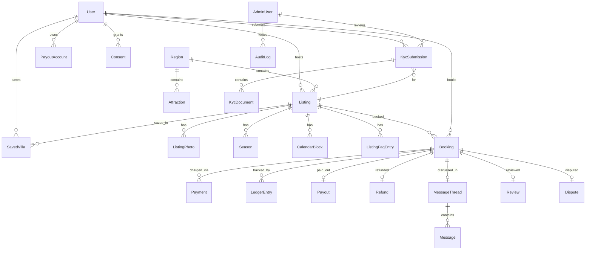

# U-Rest data model — full catalog

**Status:** Designed in full 2026-06-12 (grill #7, decisions in ADR-011) · **Implemented:** identity (PR #1) + listings domain (Phase 2 slice) + booking/escrow + social tables (Phase 3 slice, issue #19 — with `lib/booking` + `lib/ledger`; social-table logic still lands in #24/#26/#27/#28). Phase 4 tables below are the agreed design and land with their guarding `lib/` modules — change them here FIRST, then implement.
**Contract:** every enum mirrors `PRODUCT_FLOWS.md` state machines verbatim. Conventions: money = `Int` satang · `DateTime` = UTC · cuid ids · transitions only inside `lib/<domain>/`.

Legend: ✅ migrated now · 🔒 Phase 3 (booking/escrow) · 🤖 Phase 4 (AI)

## ERD (implemented + Phase 3 core)

## Identity domain ✅ (PR #1 — see ADR-007/010)

`User` (nullable PII, soft-delete/anonymize/suspend; **`passwordHash?` argon2id for email+password login, ADR-007**) · `Account`/`Session`/`VerificationToken` (Auth.js, DB sessions; **`Account` holds Google/Facebook/LINE OAuth, accounts linked by verified email**) · `PhoneOtp` (salted hashes) · `AdminUser` (separate table, argon2 + encrypted TOTP) · `KycSubmission` → `KycDocument` (private-R2 keys, `purgeAfter` 90d) · `PayoutAccount` (`accountNumberEnc` AES-GCM) · `Consent` + `AuditLog` (append-only).

## Listings domain ✅ (Phase 2 slice — in schema.prisma now)

| Model | Purpose | Notable |
|---|---|---|
| `Region` | Lookup table (NOT enum) | `isActive` gates GTM expansion — launching เขาใหญ่ is an INSERT |
| `Listing` | The villa | `ListingStatus` per §2.2; amenities `Amenity[]`; pricing = base weekday/weekend + `holidaySatang?`; `instantAckAt` = §4.1 strike acknowledgment; `legalBadgeAt` = ถูกต้องตามกฎหมาย; live source for NEW quotes only (bookings snapshot) |
| `ListingPhoto` | Public-bucket images | `isCover`, sortOrder; min-5 in lib/listing |
| `Season` | Named host season + rates | **DB-level overlap ban** (constraint №2 below) |
| `ThaiHoliday` | System holiday calendar | night is holiday-priced if `date ∈ table` or `date+1 ∈ table` (eves); lunar dates need official verification before Phase 3 launch |
| `CalendarBlock` | Host manual blocks | block-vs-booking checked in lib; booking-vs-booking = constraint №1 |
| `ListingFaqEntry` | Per-listing Q&A | feeds `get_listing_details`; ADMIN_SUGGESTED from the §5.7 loop |
| `SavedVilla` | ♡ flat list | composite PK (userId, listingId) |
| `Attraction` | Curated POIs per region | embedding column deferred to Phase 4 (model choice) |
| `NotificationLog` | Channel of record (ADR-005) | retry sweep on (status, createdAt); doubles as LINE quota monitor |

## Booking domain 🔒 (Phase 3 — lands with lib/booking + lib/ledger)

| Model | Key fields | Why shaped this way |
|---|---|---|
| `Booking` | `code` @unique (UR-YYMM-NNNN, assigned at CONFIRMED) · `BookingStatus` (§2.1 verbatim: REQUESTED, AWAITING_PAYMENT, CONFIRMED, CHECKED_IN, COMPLETED, DECLINED, EXPIRED, CANCELLED_BY_GUEST, CANCELLED_BY_HOST, DISPUTED) · checkIn/checkOut @db.Date · **snapshot block**: `priceLines Json`, totalSatang, commissionSatang, cancellationTier, houseRulesText, bookingMode · **timers**: respondBy?, payBy? · `escrowState` cache (NONE, HELD, RELEASABLE, FROZEN, PAID, REVERSED) written ONLY by lib/ledger · contactUnmaskedAt? | Snapshot = host edits can't move an agreed price (ADR-011 №3); timers are rows swept by cron (rule 3); payout releases at checkout (ADR-012) so the due-list sweep is keyed on checkOut; indexes: (status,respondBy), (status,payBy), (escrowState,checkOut) due-list, (listingId,checkIn) |
| `BookingCodeCounter` | yearMonth @id, counter | `SELECT … FOR UPDATE` in the confirm transaction |
| `Payment` | opnChargeId @unique, method (PROMPTPAY,CARD), amountSatang, status (PENDING, SUCCESSFUL, FAILED, EXPIRED), qrExpiresAt? | one row per charge attempt — QR regeneration = new row |
| `WebhookEvent` | opnEventId @unique, payload Json, processedAt? | idempotency before processing (rule 6) |
| `LedgerEntry` | bookingId, amountSatang, fromState?→toState, cause enum, causeRef | **append-only** (ADR-003); invariant property-tested |
| `Refund` | refundSatang, retainedHostSatang, retainedPlatformSatang | 90/10 split of retained (§3.6) |
| `Payout` | bookingId @unique, payoutAccountId, hostAmountSatang, slipRef, paidByAdminId | manual run v1 (§5.2) |
| `PayoutHold` | bookingId? XOR hostUserId? (constraint №4), reason, createdBy/releasedBy admin | due-list skips active holds (§2.3) |
| `HostStrike` | hostUserId, bookingId?, reason (HOST_CANCELLED, STALE_CALENDAR_DOUBLE_BOOKING) | 3 strikes → suspension (lib/booking) |

## Social domain 🔒 (Phase 3)

| Model | Key fields | Notes |
|---|---|---|
| `MessageThread` | bookingId @unique | opens at REQUESTED (§3.5) |
| `Message` | threadId, senderId, **bodyRaw + bodyMasked + wasMasked** (ADR-011 №5), readAt? | masking frozen at write; raw readable ONLY in admin dispute view; LINE-push throttle via NotificationLog timestamps |
| `Review` | bookingId @unique, overall + 4 sub-scores (ความสะอาด/ตรงตามรูป/การติดต่อโฮสต์/ความคุ้มค่า §3.4), photoKeys[], removedByAdminId?/removedAt? | one per booking, no edits; soft moderation removal (reason in AuditLog) |
| `GuestRating` | bookingId @unique, score 1–5 | host→guest, shown to future hosts |
| `Dispute` | bookingId @unique, status (OPEN, RESOLVED_RELEASED, RESOLVED_PARTIAL, RESOLVED_REFUNDED), partialRefundPct?, guestAppealedAt?/hostAppealedAt? | dispute window = check-in → checkout + one-appeal-each in lib/booking (§5.3) |
| `Report` | reporterId? (nullable: logged-out listing reports), **bookingId?/listingId?/reviewId?/reportedUserId? + CHECK exactly-one** (constraint №3), status (RECEIVED, IN_REVIEW, RESOLVED, DISMISSED) | the §5.6 queue; money-at-risk via bookingId join |

## Concierge domain 🤖 (Phase 4 — AI_CONCIERGE_SPEC §5)

`ConciergeSession` (userId?, scopedListingId?) · `ConciergeMessage` (role, content, toolCalls Json; 12-month purge) · `ConciergeUsage` (tokens, costSatang) · `UnansweredQuestion` (listingId, questionText, status OPEN/CONVERTED/DISMISSED → §5.7 admin view). Phase 4 also adds `embedding vector(<dim>)` columns to `Listing` + `Attraction` once the embedding model (and thus dimension) is chosen.

## Raw-SQL constraint inventory

Prisma can't express these — they are appended by hand to the generated migration SQL (this file is their registry; a migration touching these tables must preserve them):

| № | Table | Constraint | Purpose |
|---|---|---|---|
| 1 | `Booking` 🔒 | `CREATE EXTENSION IF NOT EXISTS btree_gist;` then `EXCLUDE USING gist ("listingId" WITH =, daterange("checkIn","checkOut") WITH &&) WHERE (status IN ('AWAITING_PAYMENT','CONFIRMED','CHECKED_IN'))` | double-bookings impossible even under instant-book races |
| 2 | `Season` ✅ | `EXCLUDE USING gist ("listingId" WITH =, daterange("startDate","endDate",'[]') WITH &&)` | overlapping seasons impossible (§4.1) |
| 3 | `Report` 🔒 | `CHECK (num_nonnulls("bookingId","listingId","reviewId","reportedUserId") = 1)` | polymorphic target integrity |
| 4 | `PayoutHold` 🔒 | `CHECK (num_nonnulls("bookingId","hostUserId") = 1)` | hold scope is exactly one of booking / whole host |

App-level checks still run first in `lib/` for friendly errors; the constraints are the last line of defense.

## Index strategy (beyond FK defaults)

Search: `Listing(regionId, status)` · host dashboards: `Listing(hostId, status)` · sweeps: `Booking(status, respondBy)`, `Booking(status, payBy)`, `NotificationLog(status, createdAt)`, `KycDocument(purgeAfter)` · payout due-list: `Booking(escrowState, checkOut)` · queues: `KycSubmission(status, submittedAt)`, `Report(status, createdAt)` · chat: `Message(threadId, createdAt)` · amenities filter: GIN on `Listing.amenities` (raw SQL if Prisma's `type: Gin` lags).
